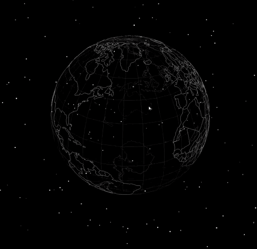
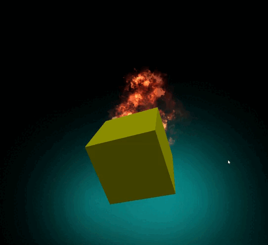
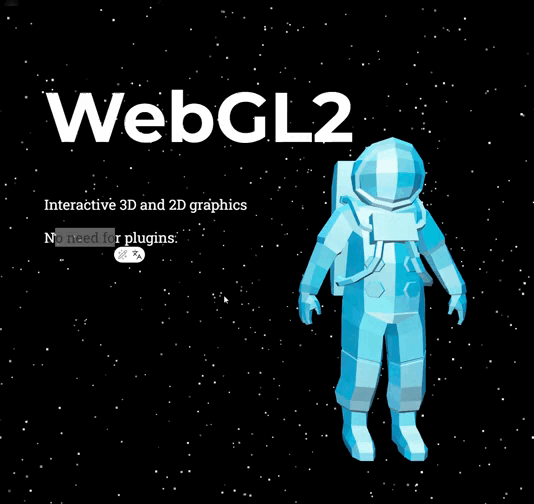

# Three JS + Vite

En este repositorio muestro algunos proyectos del video JavaScript Tutorial with Three.js – 5 Projects for Beginners de Robot Bobby solo que usando Vite y npm para instalacion de paquetes.

## Built With
This project was built using:
*   [Vite](https://vitejs.dev) - Next generation frontend tooling
*   [Vanilla JavaScript (ES6)](https://developer.mozilla.org) - The core language

## Getting Started

To get a local copy up and running, follow these simple steps.

### Prerequisites

You will need [Node.js](https://nodejs.org) (version 20.19+, 22.12+ recommended) installed on your machine.

### Installation

1.  **Clone the repository:**
    ```bash
    git clone https://github.com/miguelruizF/threeJS-examples.git
    ```
2.  **Navigate into the project directory:**
    ```bash
    cd threeJS-examples
    ```
3.  **Install dependencies:**
    ```bash
    npm install
    # or
    yarn install
    # or
    pnpm install
    ```

## Usage

### Development Server

To start the local development server with Hot Module Replacement (HMR):
```bash
npm run dev
```

## Projects

### Scene Project


### Globe Project


### Effects Project


### Scroll Effect

